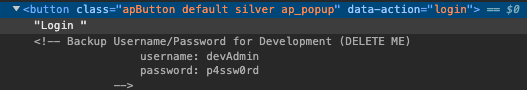

# Fall 2023 - Week 6: Secret Vault

### Category: Web

### Link: https://5up3r5ecr3tv4u1t.me/

### Description: 
As part of a top secret agency, you've been investigating an underground criminal organization. Finally, your hardwork has paid off and you have found the login page for an encrypted secret vault. 

The vault holds valuable digital information and a clue into how the organization is being financed. We need that information! Unfortunately, the only way to access the vault is by inputting the correct username and password.

Inspect this seemingly innocuous page to crack open the vault and seize the criminal assets.

### Solution:
Reading the description, the first keyword that stuck out to me was 'inspect'. I navigated to the link and on the login button, I right clicked on it to inspect the source HTML code. In the comments of the `<button>` tag was the below credentials:

I used the credentials to login in to the secret vault and retrieve the flag:

`Paws{htm1_b4ckd00r}`
