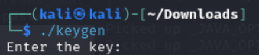
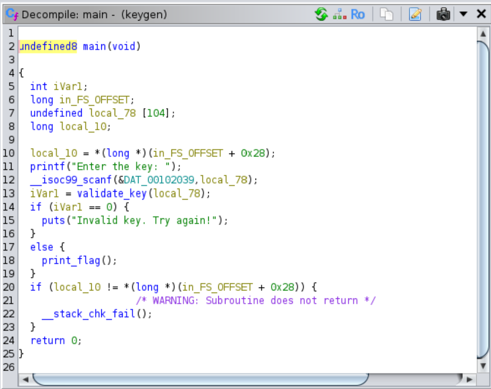
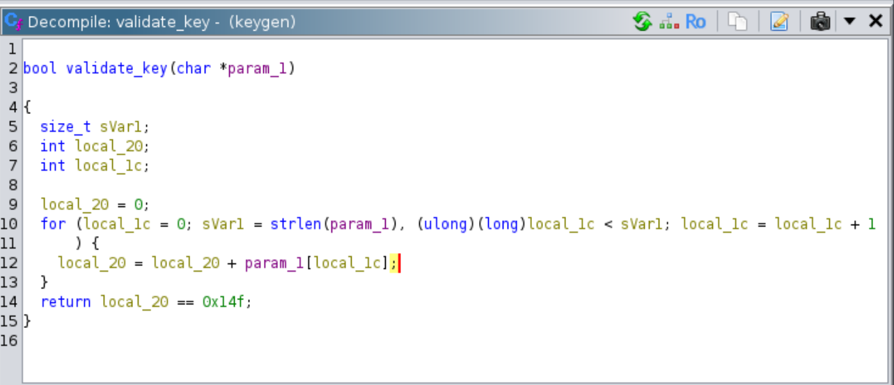

# Fall 2024 - Week 8: Key Please

### Category: Rev

### File: keygen

### Description:
Your task is to reverse-engineer a small program that checks for a specific key. The program verifies the key with a simple algorithm, and your task is to analyze this process and deduce the correct key. Can you figure out the validation logic and generate a key that passes the check?

### Solution:
To run the binary keygen program we would first add the execute permissions to the program:
```bash
chmod +x keygen
```

I then ran the program on my Kali Linux:
```bash
./kegen
```
This outputs:



To reverse engineer the program, we would be using Ghidra. To run ghidra:
```bash
./ghidraRun
```

Add the keygen program to your Ghidra's active project and launch the analyzer tool. Under the Functions folder, we would first look at the `main` function:



To breakdown what the main function is doing:
1. The main function takes the user's input as `local_78` and runs the `validate_key` function to validate the key. 
2. If the key is valid, the main function prints the flag.
3. Else the main function prints the invalid key message.

Navigate to the `validate_key` function:



A breakdown of what the `validate_key` function is doing:
1. The function initializes the `local_20` to 0, which will be used to accumulate the sume of the ASCII values of the characters in the input string.
2. It calculates the length of the input string with `strlen(param_1)`
3. It iterates through each character in the string, adding the ASCII value of each character to `local_20`.
4. After the loop, it checks if the sum (`local_20`) id equal to `0x14f` which is 335 in decimal.

In summary, the ASCII values of our input string should equal to 335.

The ASCII value I will use is "ABCDE" which is 65 + 66 + 67 + 68 + 69 = 335.

Back to the command line run the `keygen` program and enter the key `ABCDE`.

Flag is `Paws{k3y_t0_rE}`
