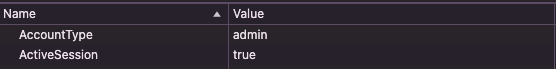

# Fall 2024 - Week 9: Cookie Monster

### Category: Web

### Description:
My favorite biscuit site is down but I need to order a new box before I run out! Could you find a way in to the site for me? Here is the link to the site https://bit.ly/PawsCTFChallenge

### Solution:
The first hint I observed from this CTF was that it was a Web-based CTF and the title is "Cookie Monster" so it is safe to say this CTF has to do with manipulating the cookies of the site. 

Once you navigate to the site, register an account and login in to the site. Once logged in go to the Developer tools of your browser (I used Google Chrome) and go to the Cookies section under the Application tab. 

Edit the values of `AccountType` and `ActiveSession` to `admin` and `true` respectively, then refresh the page.

Flag is `Paws{SH0RTBR34D_B15CU1T}`
