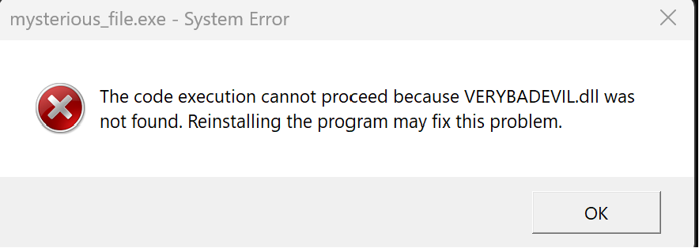
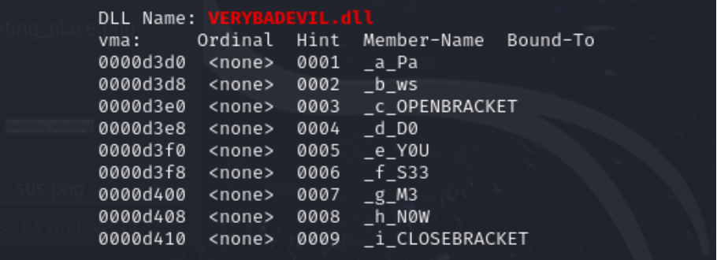

# Spring 2024 - Week 3: Mysterious File

### Category: Reverse Engineering

### Files: mysterious_file.zip

### Description: 
Your longtime employment on your company's incident investigation team is usually quiet. However, that is all about to change. An employee has contacted the team about a “mysterious file” they received in an email attachment. 

You and your team immediately become suspicious of the file and believe it might be malware. Furthermore, your boss is pressuring you all to provide answers ASAP. It's critical that you import your knowledge and get to the bottom of this. Best of luck, and hopefully, you can find the true functions of this file. 

The password for the zip file is "infected"

(Note: The file is not actually “malware.” You can pretend you're running it in a safe environment.)

### Solution:
Since the .exe file isn't an actual malware. I ran the file but an error message was produced:
 

Then I used Objdump to analyze the .dll :
```bash
objdump -x mysterious_file.exe | grep -i -C 10 "VERYBADEVIL.dll"
```

The above command is using the objdump tool to display all headers in the VERYBADEVIL.dll file, including sections like the file headers, section headers, and symbol tables.

The outuput was:
 

The Flag is `Paws{D0Y0US33M3N0W}`

NOTE: Objdump is a command-line tool used primarily for analyzing and displaying information about binary files, such as object files, executables, shared libraries, and even core dumps. It's widely used in software development, reverse engineering, and security analysis.
