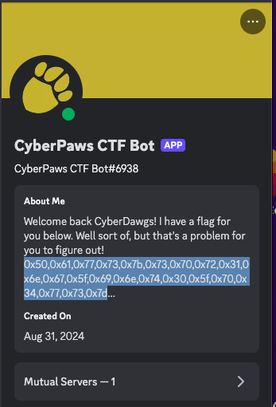

# Spring 2025 - Week 1: Meet the Bot Again

### Category: Crypto/OSINT

### Description: 
Welcome Back to CyberPaws! Regardless if this your first challenge or your 50th, we are excited to have you back! For this semester's first challenge, you should use this week to familiarize yourself with the bot again and any information it might have to share 'about' itself. But be aware, the bot likes to play games. Don't expect the flag to be revealed without some work!

### Solution:
In the CyberDawgs Discord channel, search for the CyberPaws CTF Bot. Once you find it, navigate to the about page of the bot - you will see under its description a hex encoding:

Copy the encoding and navigate to CyberChef, decode the hex encoding using the `From Hex` tool.

The Flag is `Paws{spr1ng_int0_p4ws}`
