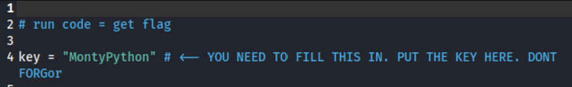

# Spring 2025 - Week 2: A Little Hide & Seek

### Category: Steganography

### Files: treasuremap.jpg, treasurehunt.py

### Description:
Alright so you’ve got an image file that looks totally normal, at first glance, but we all know, in the world of CTFs, nothing is as it first seems. Your mission this week, should you choose to accept it, is to extract a hidden treasure (the flag for this challenge)! Easy enough, but you'll have to work a little bit for it. 

I've done all I can to get us this far. I can give you a map to the treasure (.jpg) and a python script you can use to hunt it down (.py), but the only way to unlock that treasure is by solving a small puzzle. Take a look at the python script and see that it's all ready to go, but it’s missing a critical piece: the secret key! 

Don't Panic! This is nothing more than a little hide & seek.

### Solution:
The first thing I did was to head over to `treasurehunt.py` to get an idea of what the code is doing. From previewing the code, it was clear that by running the code, I would retrieve the flag for this CTF. But there was one thing missing from the code - the key. From the description of the CTF, it is clear that the key is hidden somewhere in the `treasuremap.jpg` file.

After reviewing the python script, I headed over the .jpg file to extract information that would lead to the retrieving the key. I ran some of the following commands which were unfortunately unsuccessfull:

```bash
exiftool treasuremap.jpg
binwalk treasuremap.jpg
strings treasuremap.jpg
```

After trying the above commands, my last card was to use the `steghide` tool which is a steganography tool that allows you to hide and extract data within image and audio files.

```bash
steghide extract -sf treasuremap.jpg
```

* `steghide`Calls the steghide tool.
* `extract` Tells steghide to extract any hidden data from the file.
* `-sf treasuremap.jpg` Specifies the stego file (the image suspected of hiding data).

Running the steghide command produces the file `key.txt`. Opening the .txt file will reveal the key which is `MontyPython`. 

Now that we have the key, I went back to the `treasurehunt.py` file and pasted the key in the `key` variable. 



Finally, we run the python code:

```bash
python treasurehunt.py
```

Flag is `Paws{i5Nt_1t_py7h0N1C}`

