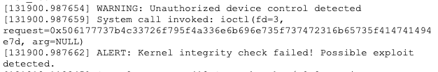

# Spring 2025 - Week 3: Panic! At the Kernel

### Category: Forensics

### Files: kernel_panic.log

### Description:
Yes, it happened again. As I'm sure you're already aware, our company was hit with another ransomware attack. Phishing emails, am I right? Well, we paid the ransom (against my better judgment), and everything was supposed to be fine. But Jenkins decided to be "funny" instead of keeping things professional. He thought it would be hilarious to heckle the ransomware operators. 

Turns out, they value their pride almost as much as they value my money, and they activated the ransomware’s self-destruct mechanism. Click, click, boom. Simulated kernel panic. They nuked our critical server into a death spiral of failed reboots. Three times it tried to recover, and three times it crashed again. Now it’s completely stuck, and the poor thing was only up 36 maybe 37 hours. 

Fortunately, the ransomware’s seppuku signal uses a toggle mechanism. The same key that brought it down should be able to bring it back up. It’s in the kernel panic syslogs somewhere. Find it, yea? 

You deal with that and I'll deal with Jenkins.

### Solution:
This CTF was pretty straight forward as all we had to do was review the `kernel_panic.log` file and figure out the kill switch for the ransomware. After reviewing the log file, I was able to find some interesting hex encoding that seemed to be key:

I navigated to CyberChef to decode the `0x506177737b4c33726f795f4a336e6b696e735f737472316b65735f414741494e7d` encoding and get the flag.

Flag is `Paws{L3roy_J3nkins_str1kes_AGAIN}`
